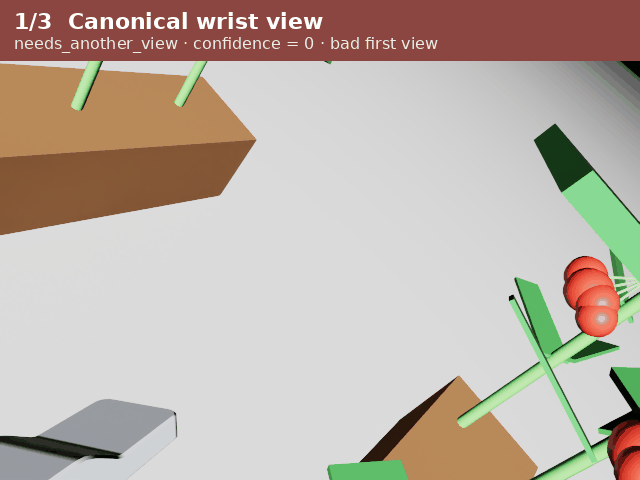
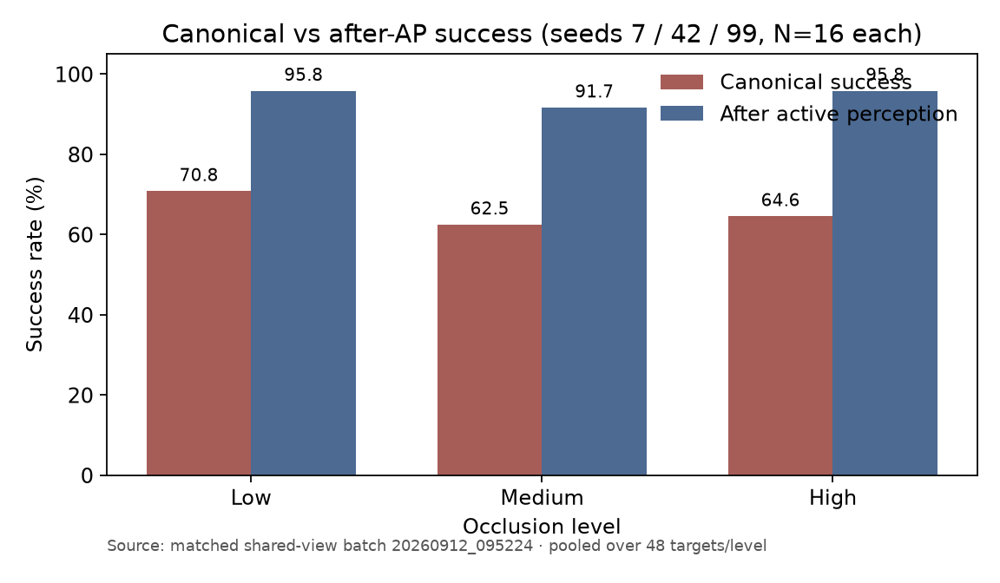
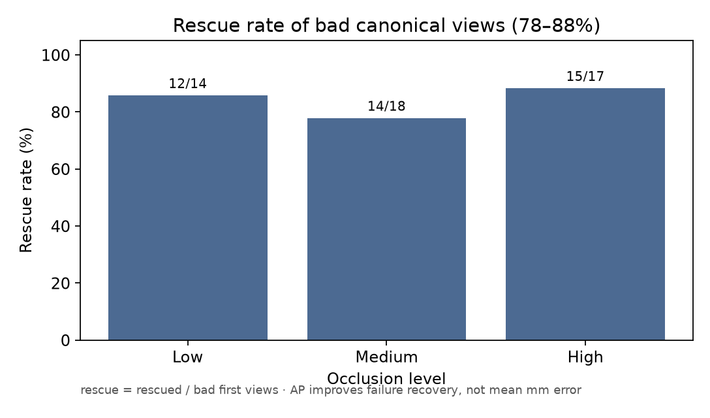
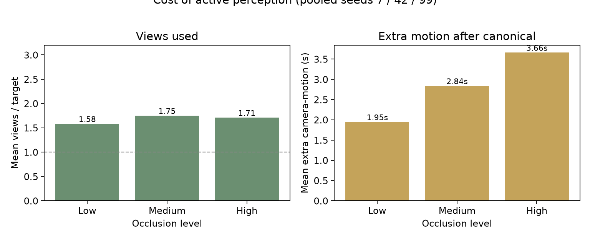

# HarvestLoop

Isaac Sim greenhouse tomato harvesting with a **frozen** Jackal + UR5e controller. Research question:

> Does **active wrist-camera perception** improve harvest **robustness** under occlusion — by rescuing bad first views — without changing the manipulation controller?

**Main claim:** Active perception improves failure recovery / robustness. **78–88%** of bad canonical views are rescued across occlusion levels. Scene seed strongly affects difficulty. Mean localization error does **not** consistently improve.

### Demo video

Detection → active views → harvest (seed 7, high occlusion; 24s):

[![Detection and harvest demo]](docs/demo/harvest_detection_clip.gif)



## Overview

In a narrow aisle, leaves and fruit occlude the peduncle. A single canonical wrist view often yields a bad cut/grasp estimate. HarvestLoop keeps the estimator and RMPflow harvest controller fixed, then asks whether a few extra wrist views recover those failures.

## System architecture

```text
scene (seed + occlusion level)
        │
        ▼
Jackal aisle-1 route  →  aimed wrist viewpoint
        │
        ▼
RGB-D capture  →  estimate_target(rgb, depth, camera_pose)
        │                         │
        │                         ▼
        │              cut_point, grasp_point, confidence,
        │              needs_another_view
        │                         │
        ▼                         ▼
hidden USD CutPoint/GraspPoint    RMPflow: grasp → cut → carry → basket
        │                         │
        └──── scoring only ───────┘
```

- **Platform:** Clearpath Jackal + 0.6-scale UR5e + Robotiq Hand-E (GraspTip, CutterTip, WristCamera)
- **Control:** frozen backbone ([`BACKBONE.md`](BACKBONE.md)); GraspTip ≤ 3 cm, CutterTip ≤ 4 cm
- **GT markers:** present on the USD stage, hidden from RGB; never read by the harvest controller after `estimate_target`

## Perception pipeline

1. Capture wrist RGB-D at the aimed pose.
2. Keypoint estimator returns **K1 = cut**, **K2 = grasp**, confidence, and `needs_another_view`.
3. If the first view is good → harvest from that estimate.
4. If bad / flagged → take up to two lateral wrist moves (`+X`, `−X`), re-estimate, select the best estimate, then harvest.

Estimator, thresholds, and controller stay identical across conditions.

## Fixed vs active protocol

| | Canonical (fixed first view) | Active perception (same trial) |
|---|---|---|
| Capture | View 1 only | Continues only if view 1 is bad / `needs_another_view` |
| Max views | 1 | 3 (`canonical`, `lateral_plus_x`, `lateral_minus_x`) |
| First RGB-D | Shared | Shared (same capture) |
| Estimator / tolerances | Frozen | Frozen |

**Primary metric**

```text
rescue_rate =
  # bad canonical views recovered by extra views
  / # bad canonical views
```

Headline success:

```text
canonical_success = 1 - canonical_fail_rate
final_success     = canonical_success + canonical_fail_rate × rescue_rate
```

## Matched experiment design

Final batch: **`20260912_095224`**

| Factor | Setting |
|---|---|
| Seeds | 7 / 42 / 99 |
| Targets | 16 locked trusses per seed (same paths, stops, order) |
| Occlusion | low / medium / high |
| Protocol | Shared first view; active may take extra views |
| Cells | 9 seed × occlusion cells · N = 16 each · 48 pooled / level |

Leaf density varies with occlusion while plant structure stays locked per seed, so comparisons are matched rather than reshuffled scenes.

## Results

Pooled over seeds 7 / 42 / 99 (48 targets per occlusion level):

| Occlusion | Canonical success | After AP | Rescue of bad first views | Mean views | Extra motion |
|---|---:|---:|---:|---:|---:|
| Low | 70.8% | **95.8%** | **86%** (12/14) | 1.58 | 1.95 s |
| Medium | 62.5% | **91.7%** | **78%** (14/18) | 1.75 | 2.84 s |
| High | 64.6% | **95.8%** | **88%** (15/17) | 1.71 | 3.66 s |







**Read carefully**

- Active perception improves **failure recovery / robustness** (+25–31 pp final success).
- **78–88%** of bad first views are rescued.
- Scene seed strongly affects difficulty (e.g. seed 42 is much harder than seed 99).
- Pooled canonical failure is **not** monotone in occlusion — do not claim “harder occlusion ⇒ worse.”
- Mean localization error does **not** consistently improve after AP.

Full tables: [`results/suites/20260912_095224/batch_benchmark.md`](results/suites/20260912_095224/batch_benchmark.md).

## Limitations

- Simulation only (Isaac Sim); no real-robot transfer study.
- Viewpoint policy is a small fixed lateral set, not learned NBV.
- Rescue can still fail; a few trials are harmed or unrecovered.
- Harvest success depends on both perception and the frozen controller tolerances.
- Results are seed-sensitive; three seeds are illustrative, not a full Monte Carlo.

## Tech stack

- NVIDIA Isaac Sim (Kit / PhysX / Replicator RGB-D)
- Python, NumPy, Pillow, Matplotlib
- RMPflow arm motion, scripted Jackal aisle navigation
- Deterministic USD scene generation (`scripts/scenegen`)

## Run

Isaac Sim must already be open (or started by the scene builder).

### Matched LOW / MEDIUM / HIGH sweep (Script Editor)

```python
SEEDS = (7, 42, 99)
MAX_TARGETS = 16
LEVELS = ("low", "medium", "high")
exec(open("/path/to/harvestloop_sim/scripts/run_occlusion_suite.py", encoding="utf-8").read(), globals())
```

### Score the batch (no Isaac)

```bash
python3 scripts/analyze_occlusion_suite.py --batch 20260912_095224 --expect-n 16
```

### Single-level shared-view pilot

```python
MAX_TARGETS = 16
OCCLUSION = "medium"
SEED = 42
exec(open("/path/to/harvestloop_sim/scripts/run_shared_view_experiment.py", encoding="utf-8").read(), globals())
```

```bash
python3 scripts/analyze_rescue_benchmark.py <experiment_id>
```

### What is frozen

See [`BACKBONE.md`](BACKBONE.md). Do not change navigation, grasp/cut tolerances, retreat, basket logic, route structure, estimator thresholds, or benchmark scoring unless fixing a clear bug. Allowed for future work: estimator internals behind `estimate_target`, logging, and viewpoint policy experiments.
