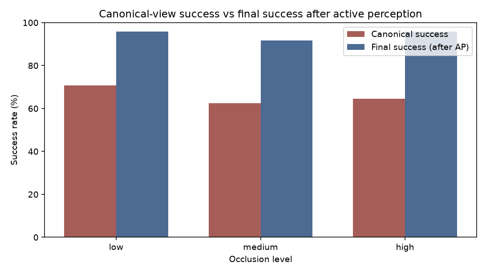
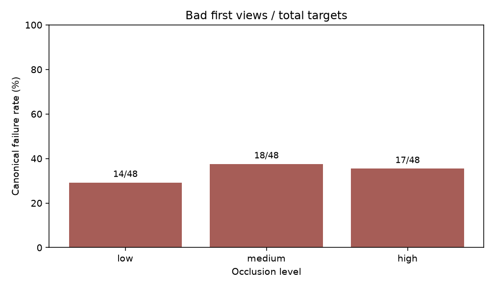
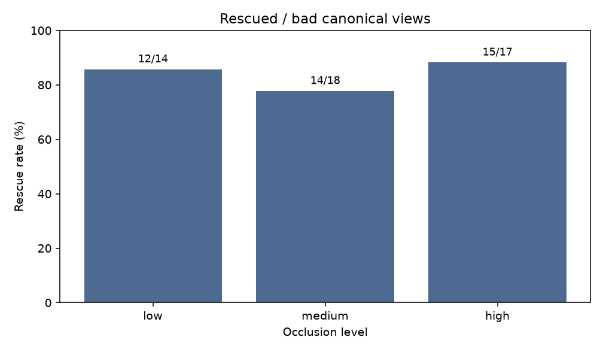
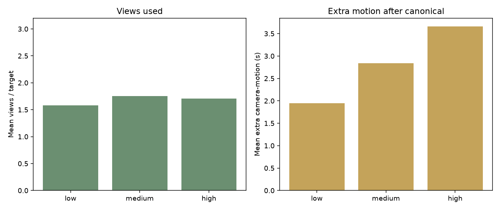

# Matched occlusion batch: `20260912_095224`

- Seeds: 42, 7, 99
- Protocol: shared_view_rescue_matched_manifest
- Each seed × occlusion cell uses locked N=16 targets

## Headline (pooled): canonical vs final success after AP

```text
canonical_success = 1 - canonical_fail_rate
final_success     = canonical_success
                  + canonical_fail_rate × rescue_rate
```

| Occlusion | N | Canonical success | Final success (AP) | Δ (pp) | Rescue |
|---|---:|---:|---:|---:|---:|
| low | 48 | 34/48 (70.8%) | 95.8% | +25.0 | 12/14 (85.7%) |
| medium | 48 | 30/48 (62.5%) | 91.7% | +29.2 | 14/18 (77.8%) |
| high | 48 | 31/48 (64.6%) | 95.8% | +31.3 | 15/17 (88.2%) |

### Claim scope

- Active perception improves **failure recovery / robustness**.
- Do **not** claim monotonic improvement with occlusion (pooled canonical-fail is not monotone here).
- Do **not** claim AP improves mean localization / cut accuracy.

## Per-seed cells (verify N=16)

| Seed | Occlusion | N | Canonical success | Final success | Rescue |
|---:|---|---:|---:|---:|---:|
| 42 | low | 16 | 7/16 (43.8%) | 93.8% | 8/9 (88.9%) |
| 42 | medium | 16 | 7/16 (43.8%) | 87.5% | 7/9 (77.8%) |
| 42 | high | 16 | 6/16 (37.5%) | 87.5% | 8/10 (80.0%) |
| 7 | low | 16 | 12/16 (75.0%) | 93.8% | 3/4 (75.0%) |
| 7 | medium | 16 | 11/16 (68.8%) | 87.5% | 3/5 (60.0%) |
| 7 | high | 16 | 12/16 (75.0%) | 100.0% | 4/4 (100.0%) |
| 99 | low | 16 | 15/16 (93.8%) | 100.0% | 1/1 (100.0%) |
| 99 | medium | 16 | 12/16 (75.0%) | 100.0% | 4/4 (100.0%) |
| 99 | high | 16 | 13/16 (81.2%) | 100.0% | 3/3 (100.0%) |

## Figures









