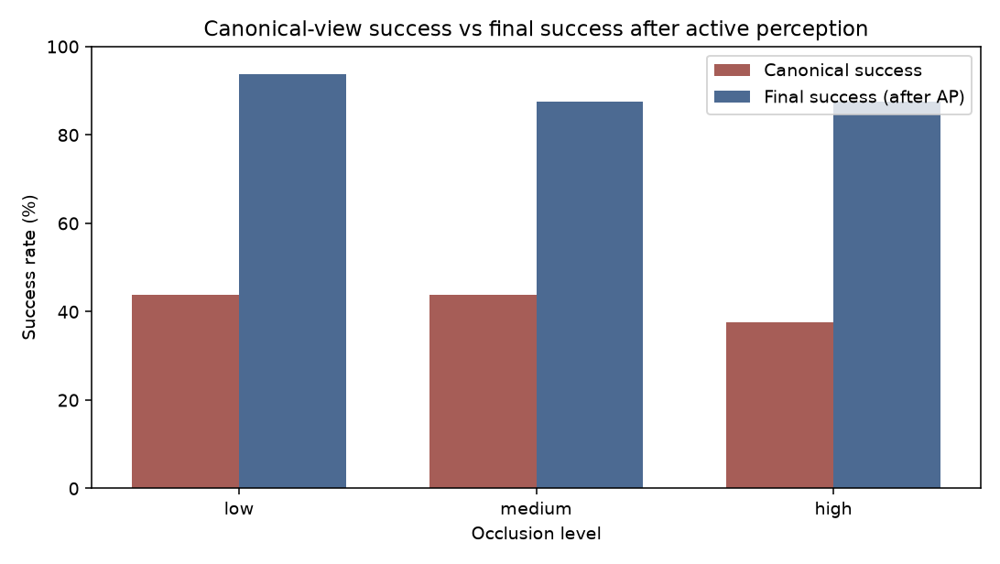
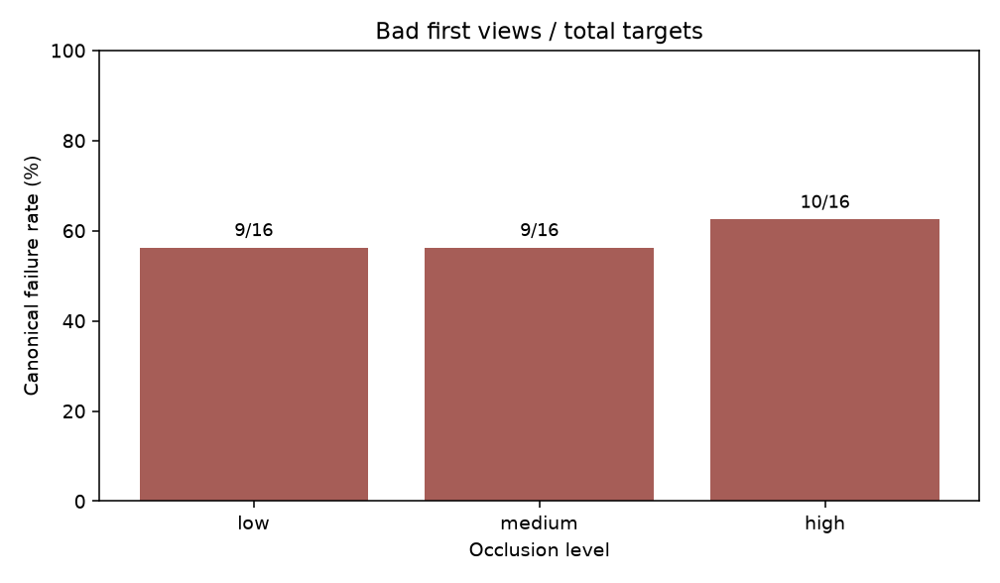
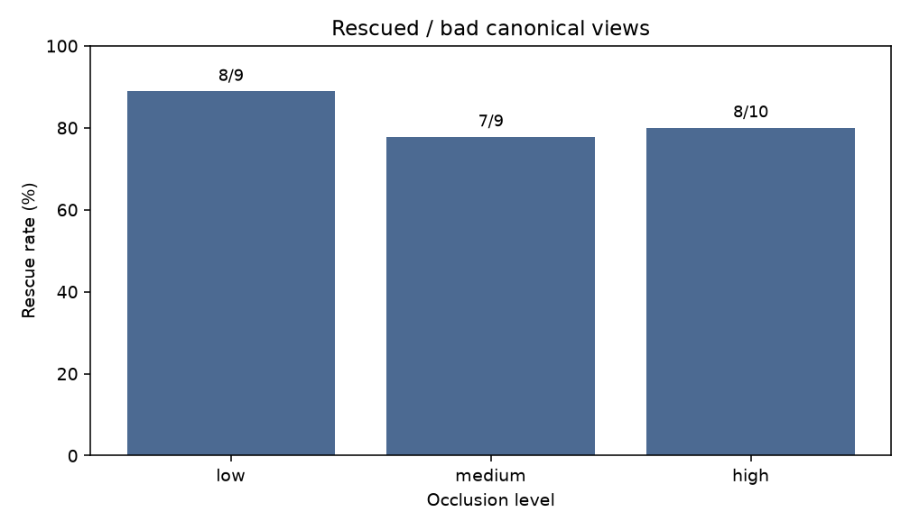
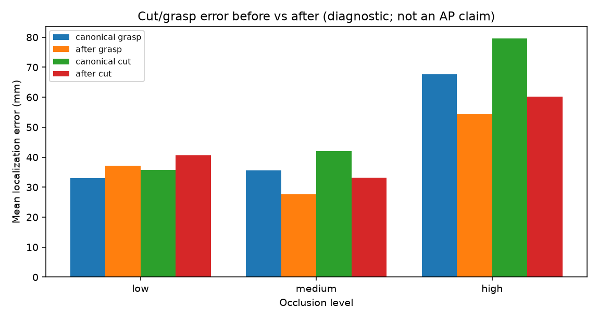
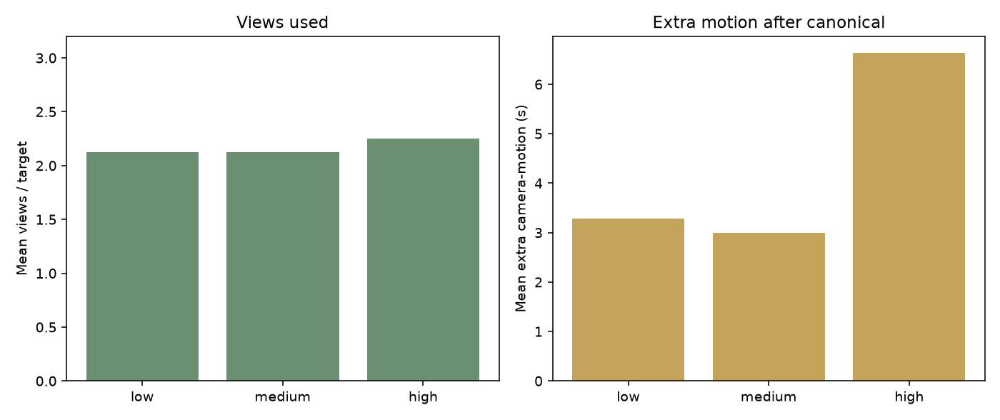

# Matched occlusion suite: `20260912_095224__s42`

- Scene seed: `42`
- Max targets: `16`
- Locked targets: `16`
- Protocol: `shared_view_rescue_matched_manifest`
- Levels: low, medium, high

## Headline: canonical success vs final success after AP

```text
canonical_success = 1 - canonical_fail_rate
final_success     = canonical_success
                  + canonical_fail_rate × rescue_rate
```

| Occlusion | N | Canonical success | Final success (AP) | Δ (pp) | Rescue |
|---|---:|---:|---:|---:|---:|
| low | 16 | 7/16 (43.8%) | 93.8% | +50.0 | 8/9 (88.9%) |
| medium | 16 | 7/16 (43.8%) | 87.5% | +43.8 | 7/9 (77.8%) |
| high | 16 | 6/16 (37.5%) | 87.5% | +50.0 | 8/10 (80.0%) |

### Claim scope

- Active perception improves **failure recovery / robustness** (rescue of bad canonical views).
- Do **not** claim monotonic improvement with occlusion.
- Do **not** claim AP improves mean localization / cut accuracy.

## Supporting metrics

| Occlusion | Canonical fail | Rescue | Views | Extra motion | Cut before | Cut after |
|---|---:|---:|---:|---:|---:|---:|
| low | 9/16 (56.2%) | 8/9 (88.9%) | 2.12 | 3.28 s | 0.0357 m | 0.0406 m |
| medium | 9/16 (56.2%) | 7/9 (77.8%) | 2.12 | 3.00 s | 0.0420 m | 0.0331 m |
| high | 10/16 (62.5%) | 8/10 (80.0%) | 2.25 | 6.64 s | 0.0796 m | 0.0601 m |

## Figures











