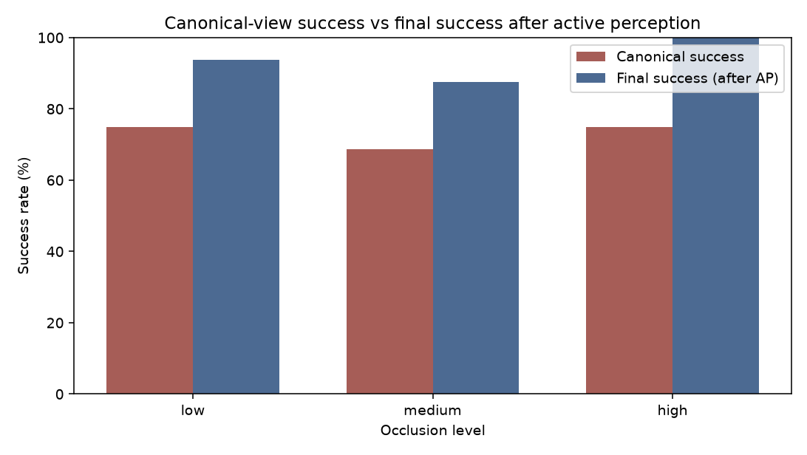
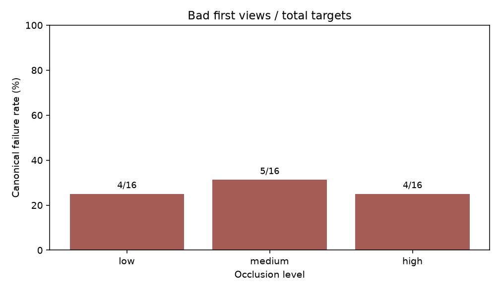
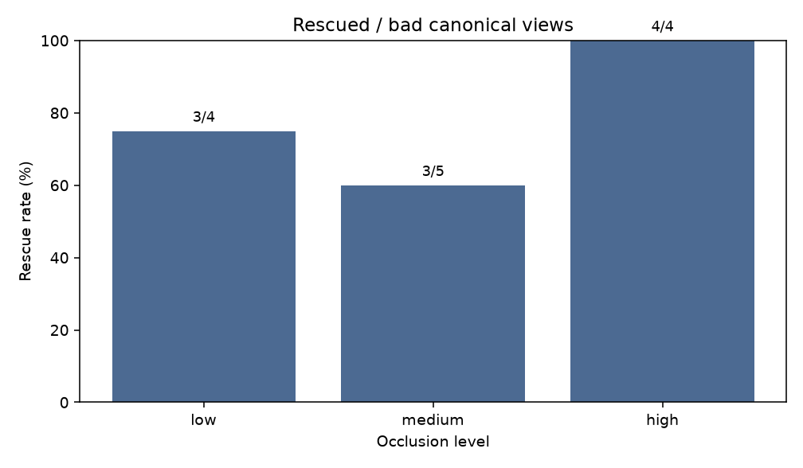
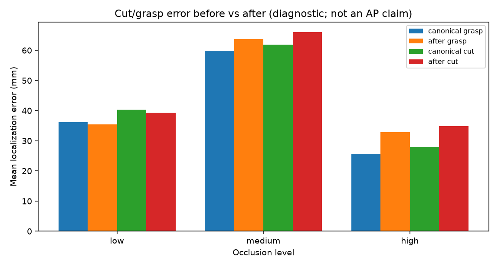
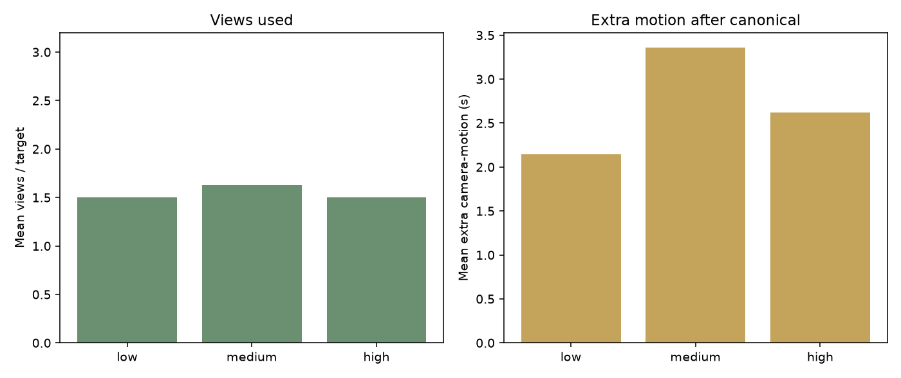

# Matched occlusion suite: `20260912_095224__s7`

- Scene seed: `7`
- Max targets: `16`
- Locked targets: `16`
- Protocol: `shared_view_rescue_matched_manifest`
- Levels: low, medium, high

## Headline: canonical success vs final success after AP

```text
canonical_success = 1 - canonical_fail_rate
final_success     = canonical_success
                  + canonical_fail_rate × rescue_rate
```

| Occlusion | N | Canonical success | Final success (AP) | Δ (pp) | Rescue |
|---|---:|---:|---:|---:|---:|
| low | 16 | 12/16 (75.0%) | 93.8% | +18.8 | 3/4 (75.0%) |
| medium | 16 | 11/16 (68.8%) | 87.5% | +18.8 | 3/5 (60.0%) |
| high | 16 | 12/16 (75.0%) | 100.0% | +25.0 | 4/4 (100.0%) |

### Claim scope

- Active perception improves **failure recovery / robustness** (rescue of bad canonical views).
- Do **not** claim monotonic improvement with occlusion.
- Do **not** claim AP improves mean localization / cut accuracy.

## Supporting metrics

| Occlusion | Canonical fail | Rescue | Views | Extra motion | Cut before | Cut after |
|---|---:|---:|---:|---:|---:|---:|
| low | 4/16 (25.0%) | 3/4 (75.0%) | 1.50 | 2.15 s | 0.0404 m | 0.0393 m |
| medium | 5/16 (31.2%) | 3/5 (60.0%) | 1.62 | 3.36 s | 0.0618 m | 0.0661 m |
| high | 4/16 (25.0%) | 4/4 (100.0%) | 1.50 | 2.62 s | 0.0279 m | 0.0348 m |

## Figures











